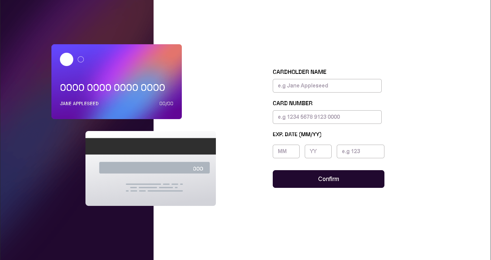
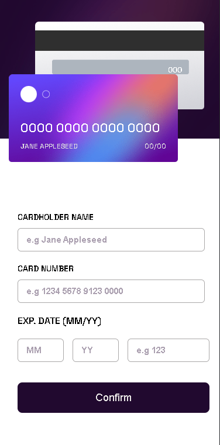

# Interactive-card-details-form

# Frontend Mentor - Interactive card details form solution

This is a solution to the [Interactive card details form challenge on Frontend Mentor](https://www.frontendmentor.io/challenges/interactive-card-details-form-XpS8cKZDWw). Frontend Mentor challenges help you improve your coding skills by building realistic projects. 

## Table of contents

- [Overview](#overview)
  - [The challenge](#the-challenge)
  - [Screenshot](#screenshot)
  - [Links](#links)
- [My process](#my-process)
  - [Built with](#built-with)
  - [Continued development](#continued-development)
  - [Useful resources](#useful-resources)
- [Author](#author)


## Overview

### The challenge

Users should be able to:

- Fill in the form and see the card details update in real-time
- Receive error messages when the form is submitted if:
  - Any input field is empty
  - The card number, expiry date, or CVC fields are in the wrong format
- View the optimal layout depending on their device's screen size
- See hover, active, and focus states for interactive elements on the page

### Screenshot





### Links

- Live Site URL: [https://shiny-hamster-a3370f.netlify.app/](https://shiny-hamster-a3370f.netlify.app/)

## My process

### Built with

- Semantic HTML5 markup
- CSS custom properties
- Flexbox
- CSS Grid
- Mobile-first workflow
- Vanilla JavaScript

### What I learned

I tried to reflect inputs values to cards at the same time and i used keyup event listener for this but im sure there are better ways to do this. I will continue to search for it.


```js
nameInput.addEventListener('keyup',function(){
})
```


### Continued development

This challange was little, fun project to do. I will continue to work on my css/responsive design skills and I will continue to learn JS fundamentals.

### Useful resources

- [w3schools](https://www.w3schools.com/) 
- [MDN](https://developer.mozilla.org/en-US/) 
- [Stackoverflow](https://stackoverflow.com/) 

## Author

- Frontend Mentor - [@Mustafacmn](https://www.frontendmentor.io/profile/Mustafacmn)
- Twitter - [@beginnercoderr](https://twitter.com/beginnercoderr)


